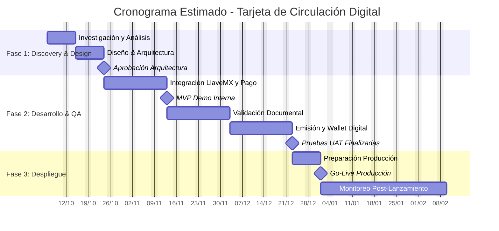

# Statement of Work (SOW)

**SOW:** [Proyecto Tarjeta de Circulación Digital]
**Cliente:** 🏛️ Gobierno de Morelos - Ciudadanía
**Proveedor:** 👨‍💻 Equipo de Desarrollo Interno  
**Fecha:** 📅 [02/10/2025]
**Versión:** 🏷️ 1.0 (Borrador)

## 1. Antecedentes
El trámite actual de Tarjeta de Circulación (renovación y nueva emisión) requiere la presencia física o el uso de múltiples portales, lo que resulta en un tiempo de servicio prolongado y una carga administrativa elevada. Este proyecto busca modernizar el proceso, alineando los servicios digitales con los estándares de la plataforma Digital.Morelos.

## 2. Objetivos del Proyecto
El objetivo principal es el diseño, desarrollo e implementación de un proceso digital fluido para la Tarjeta de Circulación de vehículos de uso privado.

**Objetivo 1 (Eficiencia)**: Reducir drásticamente el tiempo de trámite para el ciudadano.

**Objetivo 2 (Adopción)**: Aumentar la migración de trámites a la plataforma digital.

**Objetivo 3 (Experiencia)**: Entregar un documento de fácil acceso y validación (Wallet + QR).

## 3. Alcance del Proyecto
### 3.1. Dentro del Alcance
    - Trámite de Renovación de Tarjeta de Circulación para vehículos de uso privado.
    - Trámite de Nueva Emisión de Tarjeta de Circulación para vehículos de uso privado
    - Integración de Pasarela de Pago con Hacienda-Ingresos.
    - Validación de Identidad y Datos mediante LlaveMX (CURP, Nombre Completo, INE).
    - Validación de Póliza de Seguro (Consulta AMIS + Carga de Documento Asíncrono).
    - Validación de Tarjeta de Circulación Anterior (Carga de Documento Asíncrono con Cotejo Manual).
    - Emisión del documento digital en formato compatible con Google Wallet y Apple Wallet.

### 3.2. Fuera del Alcance
    - Trámites de Tarjeta de Circulación para vehículos de transporte público, carga comercial o flotillas.
    - Trámites relacionados, como Cambio de Propietario, Baja de Vehículo o Corrección de Datos.
    - Desarrollo de una aplicación móvil dedicada (el entregable se integrará a wallets existentes).

## 4. Entregables del Proyecto
    - Función: Listar todos los artefactos tangibles que se entregarán al cliente al finalizar el proyecto.
    - Objetivo: Clarificar exactamente qué recibirá el cliente.
    - Documentación Técnica: Incluye el SAD (Software Architecture Document) final y el Runbook de operaciones para el equipo de soporte.
    - Código Fuente: El código completo de la solución, versionado y alojado en GitLab.
    - Plataforma Web Funcional: La nueva funcionalidad de Tarjeta de Circulación Digital desplegada en el entorno de Digital.Morelos.
    - Guía de Ayuda: Manual de Usuario o guía detallada para el ciudadano sobre cómo realizar el trámite y cómo usar la wallet digital.
    - Capacitación: Sesión de Capacitación para el equipo de soporte de Digital.Morelos sobre el nuevo proceso y manejo de errores.

## 5. Cronograma Estimado
    - Función: Presentar un plan de alto nivel con fases, duraciones e hitos clave.
    - Objetivo: Proporcionar una visión clara de los tiempos del proyecto y establecer fechas clave.

## 6. Supuestos y Dependencias
Función: Listar las condiciones que se asumen como ciertas para que el proyecto pueda cumplirse.

Objetivo: Identificar riesgos potenciales y clarificar responsabilidades.

| Tipo | Componente | Detalle | Riesgo | Impacto |
|------|------------|---------|---------|---------|
| **Dependencia Crítica** | Hacienda/AMIS | Documentación y acceso a web services de Hacienda-Ingresos (Pasarela de Pago) y AMIS (Validación de Póliza) disponibles a demanda | Retraso en el acceso a APIs | ⚠️ Impacto directo en inicio y duración de la Fase 2 |
| **Supuesto del Cliente** | Soporte Interno | Equipo de soporte capacitado y disponible para validación manual asíncrona de documentos (KR3) desde inicio de Fase 3 | Falta de disponibilidad del equipo | ⚠️ Impacto en tiempo de resolución del trámite |
| **Supuesto de Plataforma** | LlaveMX/Digital.Morelos | Componentes de LlaveMX y plataforma Digital.Morelos operativos y consumibles por el nuevo módulo | Componentes no disponibles o incompatibles | ⚠️ Bloqueo de funcionalidades críticas |

## 7. Criterios de Aceptación de Alto Nivel
    - El sistema debe lograr una Tasa de Conversión de trámites digitales del 40% en los primeros 6 meses.
    - El tiempo promedio de interacción del ciudadano con la plataforma para completar el formulario y pago no debe exceder los 5 minutos.
    - El proceso de validación documental debe ser persistente, permitiendo al ciudadano reintentar solo las partes rechazadas.